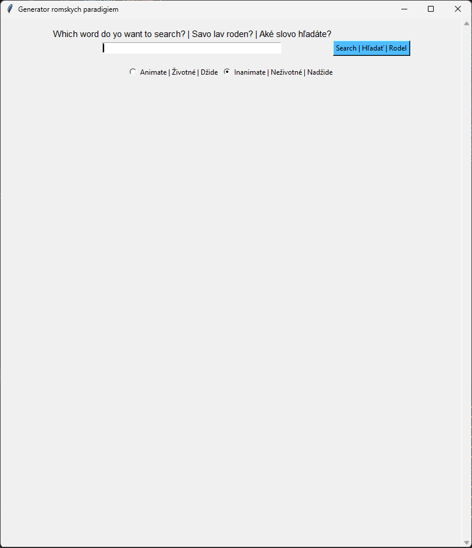

# Roma Paradigm Generator (RPG)

This tool generates Roma language (East Slovak Romani) paradigms based on input words. It works as an offline extension of [romskyslovnik.online](https://romskyslovnik.online/) and the current version supports noun and verbs paradigms generation.
#### Disclaimer: The underlying data used in this project is not owned by the author, and only a limited sample is provided in the SRO.xml file for demonstration purposes. 


## Table of Contents

- [Dependencies](#dependencies)
- [Usage](#usage)
- [Building Executable](#building-executable)


## Dependencies
If you just want to run the application and not build an executable you do not need to install any packages. Please proceed to [Usage](#usage).
If you wish to build an executable first install dependencies:
```bash
pip install -r requirements.txt
```


## Usage

Run the application:

```bash
python user_interface.py
```
Input eg. 'phral' and select appropriate animacy, in this case it is animate (Životné):



## Building Executable
To build a standalone executable run the build script:
```bash
python build_script.py
```
Locate the generated executable in the dist directory. 
Please note that the executable built using PyInstaller is platform-specific. This means:

- The executable built on **Windows** is intended for use on Windows operating systems.
- The executable built on **Unix-like systems (e.g., macOS, Linux)** is intended for use on those specific platforms.
